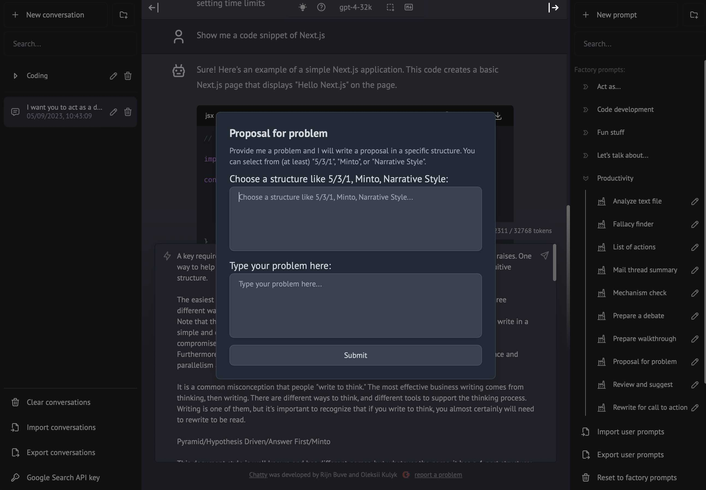

# Chatty Server (`chatty-server`)

**Note: You can find the most recent release notes [here](./public/RELEASE_NOTES.md).**

**Chatty Server** is a client interface for GPT-3.5 and GPT-4. It allows you to use
GPT-4 for many tasks. For that, it allows you to store "prompts" (in folders),
that allows you to quickly have GPT-4 analyze your text
in a certain way and respond to you.

I've created a bunch of prompts to start with. These are automatically imported
as factory prompts. On the prompt line, type `/` and search for a prompt and press enter.

For example, to summarize a mail thread efficiently, select the entire mail text
in your mail client, click on the input box in Chatty, press `/`, type `mail` and
select `Summarize mail`.

Paste the text in the dialog and press Enter. This produces the full prompt you for
GPT-4. Just press Enter again to execute it.

## Using a browser or Chatty

Chatty Server is a web-based which can be accessed by browser. It is deployed on
a server with a basepath of `/` (for the actual value, check [config.js](./config.js)).
So, if you deploy it on `https://myserver.com`, you can access it at `https://myserver.com/chatty`.

There a thin client for Mac called [Chatty](https://github.com/rijnb/ChattyUI) that you may want
to check out. It is a thin wrapper around a web view, that allows you to use Chatty Server as a
stand-alone application on a Mac.

If you like it, or if you have comments, reach out to me.

Happy chatting!

**Rijn Buve**

#### Chatty main screen example


#### Chatty prompt dialog example



## Is it safe to use?

The `chatty-server` can run on any server, but it tries to be as secure as possible.
It does _not_ store or log any of the prompts, conversations, API keys or other secrets
on the server.

All sensitive information is kept client side and stored in browser 'local storage'.

Conversations are sent (through SSL) to the server, of course, but not logged or persisted
server-side. (_Exception:_ The server logs may contain at most the first +/-20 characters of
your prompts or returned answers for debugging purposes, but never more).

## Technical documentation

When deploying `chatty-server`, make sure you set the following environment variables:

| Environment Variable           |
| ------------------------------ |
| OPENAI_API_TYPE                |
| OPENAI_API_HOST                |
| OPENAI_VERSION                 |
| OPENAI_MAX_TOKENS              |
| OPENAI_AZURE_DEPLOYMENT_ID     |
| OPENAI_DEFAULT_MODEL           |
| ------------------------------ |

## Running Locally

1. Clone Repo

```bash
git clone https://github.com/rijnb/chatty-server.git
```

2. Install Dependencies

```bash
npm install
```

3. Provide environment variables

Create a `.env.local` file in the root of the repo with the environment variables mentioned above in "Deploy".

```bash
export OPENAI_API_TYPE=azure
...
```

If you do not provide the `OPENAI_API_KEY`, the user will be prompted to provide their own key in the UI. The same
applies to the Google Search keys.

4. Run App

```bash
npm run dev
```

**5. Use It**

You should be able to start chatting at `http://localhost:3000/`.

## Configuration

When deploying the application, the following environment variables can be set:

| Environment Variable         | Default value                 | Description                                                                                                                               |
| ---------------------------- |-------------------------------|-------------------------------------------------------------------------------------------------------------------------------------------|
| OPENAI_API_KEY               |                               | The default API key used for authentication with OpenAI                                                                                   |
| OPENAI_API_HOST              | `https://api.openai.com`      | The base url, for Azure use `https://<endpoint>.openai.azure.com`                                                                         |
| OPENAI_API_TYPE              | `openai`                      | The API type, options are `openai` or `azure`                                                                                             |
| OPENAI_API_VERSION           | `2023-03-15-preview`          | Only applicable for Azure OpenAI                                                                                                          |
| OPENAI_UNLOCK_CODE           |                               | If set, the UI requires a user to unlock the UI before being able to use it.                                                              |
| OPENAI_AZURE_DEPLOYMENT_ID   | `PTU-;dep-gpt-5-nano`         | Needed when Azure OpenAI, Ref [Azure OpenAI API](https://learn.microsoft.com/zh-cn/azure/cognitive-services/openai/reference#completions) |
| OPENAI_ORGANIZATION          |                               | Your OpenAI organization ID                                                                                                               |
| OPENAI_DEFAULT_MODEL         | `gpt-5-nano`                  | The default model to use on new conversations, for Azure use `gpt-5-nano`                                                                 |
| OPENAI_DEFAULT_SYSTEM_PROMPT | [see here](utils/app/const.ts) | The default system prompt to use on new conversations                                                                                     |
| OPENAI_REUSE_MODEL           | true                          | Reuse a manually selected model for the next conversation, or fall back to the default model every time                                   |
| OPENAI_ALLOW_MODEL_SELECTION | true                          | Allow the user to selected a different model than the default model                                                                       |
| OPENAI_DEFAULT_TEMPERATURE   | 1                             | The default temperature to use on new conversations                                                                                       |
| GOOGLE_API_KEY               |                               | See [Custom Search JSON API documentation][GCSE]                                                                                          |
| GOOGLE_CSE_ID                |                               | See [Custom Search JSON API documentation][GCSE]                                                                                          |

If you do not provide an OpenAI API key with `OPENAI_API_KEY`, users will have to provide their own key.
The same applies to the Google Search keys.

Note: The value of `OPENAI_AZURE_DEPLOYMENT_ID` is a list of 1 or more IDs.

- If one of the ID matches the selected model, with some prefix, that ID is returned.
- If there's no match in the list and the first ID in the list contains a "-", the prefix of that ID is
  used for the model.
- Otherwise, if there's no "-" in the first ID, the first ID is used as-is.

This makes it possible to always append a specific prefix to the model, or to use a specific prefix for a specific
model. For example, if `OPENAI_AZURE_DEPLOYMENT_ID` is `dep-;PTU-gpt-5-nano`, then the prefix `dep-` would be
used for every model, except for `PTU-gpt-5-nano`, which would used unmodified. As you see, the first ID
does not need to be a full model name, it can just be a prefix, but it should contain a "-".

If you don't have an OpenAI API key, you can get one [here](https://platform.openai.com/account/api-keys).

## Using the Google Search plugin

The application allows you to send queries to OpenAI, or to Google Search first and have the Google results
interpreted by OpenAI/GPT-4. This is done by using the Google Search plugin.

### How to create the keys at Google

1. Create a new project at https://console.developers.google.com/apis/dashboard.

2. Create a new API key at https://console.developers.google.com/apis/credentials.

3. Enable the Custom Search API at https://console.developers.google.com/apis/library/customsearch.googleapis.com.

4. Create a new Custom Search Engine at https://cse.google.com/cse/all.

5. Add your API key and your Custom Search Engine ID to your `.env.local` file (or don't and have the user fill them in,
   in the UI).

6. You can now select the Google Search Tool in the search tools dropdown.

### Usage limits

Google gives you 100 free searches per day. You can increase this limit by creating a billing account.
Please make sure you are aware of the costs before doing so.

## Acknowledgements

This application is based on [`chatbot-ui`](https://github.com/mckaywrigley/chatbot-ui) by Mckay Wrigley.
Many thanks to him for creating the original codebase and to the authors of some of the added functionality
from PR's in that code base. Significant modifications have been made to the original codebase.

## Contact

If you have any questions, feel free to reach out to me via [mail](mailto:rijn@buve.nl).

[GCSE]: https://developers.google.com/custom-search/v1/overview

